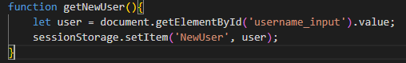
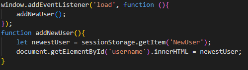
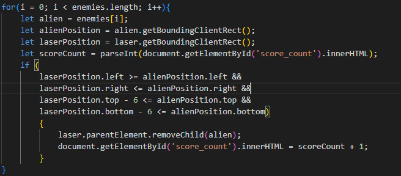
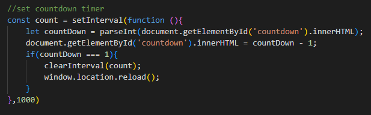

# Space Invaders

## Intended Purpose of This Website:

This website is a simple fun game that uses JavaScript to allow users to interact with it. The user can navigate the ship left and right with the left and right arrow keys on desktop and has some left and right buttons to press while on mobile or touch screen devices. They can also shoot with the spacebar being pressed down or by using the circular icon on mobile devices. The user is given one minute to shoot as many enemies as possible before the time runs out and the game re-loads. Their current score is tracked throughout the game and their name is added to the game after they enter it on the welcome screen. A live link to the deployed game is given here: [My git hub pages link of live website](https://gfpkelly1986.github.io/space-invaders/) 

# Table of Contents
   *[Live Features]()*

   *[Future Features]()*

   *[Validator Testing]()*

   *[Bugs During Development]()*

   *[Bugs To Be Resolved]()*

   *[Deployment]()*

   *[Research and plannning]()*

   *[Credits/Attributions]()*

   *[Javascript Methods Used]()*

   *[Design Process]()*

# Live Features
- Game Welcome Screen:
    - Welcome the user to the game.
    - Give an overview of the rules of the game.
    - Allow users to enter a username .
    - Button to click and get to the game board screen.

The welcome screen for this website allows users to land at the site without having to jump straight into the game. They have an oppotunity to enter their username in the text input field and read the rules of the game before it begins. The username is taken from this page and its value populates the username field above the gameboard on the playgame page of the site. Some imagery is used but is kept to a minimum as the focus of the website was on the use of Javascript.

- Game Board Screen:
   - Users name added to the top of the page
   - Current Score tab that tracks the users score
   - A countdown timer that counts down from one minute
   - Responsive game board (Enemies contained within the board)
   - The Aliens/Enemies (Controlled creation and falling rate)
   - The Users ship (Shoots laser)
   - Controls for touch screen/mobile users

### Users name added to the screen:

#### Code used to perform this function:

The above code was placed in a seperate js file (getuser.js) and the link to it placed in index.html. It was first placed in the script.js file along with the rest of the code and I had issues with the session storage being retained. I am still not fully aware why this was the case. I believe it to be due to either the window keydown event listener or the setInterval functions running within the script.js file. When watching the console logs for the user input you would see the correct value show up briefly but the console would refresh constantly, then when the game page loaded it would not keep the value and populate the username field. This soloution of seperating the code to get the username out to another js file worked for me but there probably is other solutions to this problem. This function uses the sessionSorage.setItem(keyname, value) method which takes two arguments, a keyname(string) and a value. In the case the keyname is 'NewUser' and the value is the users name, which is a string, stored in the variable called user, taken from the text input field. A link to W3C schools for this method is here: https://www.w3schools.com/jsref/met_storage_setitem.asp 

The code above was kept in the script.js file above the window-keydown-eventlistener. When the window loads it calls the addNewUser() function. The addNewUser function uses sessionStorage.getItem(keyname) method to get the value associated with the 'NewUser' keyname. It stores it in the newestUser variable and then populates the innerHTML of the element with the ID of 'username'. A link to  W3C schools for this methos is here: https://www.w3schools.com/jsref/met_storage_getitem.asp

### Current score tab that tracks the users score:

#### Code used to perform this function:

The above for loop is nested in a setInterval function which is in turn nested in an if statement that is executed within the window-keydown-eventlistener if the condition of the 'Space' key being pressed is returned true. When pressed the setInterval function runs at the default 10 millisecond time interval. The loop runs as follows every 10 milliseconds: for each item in the enemies class store each div in the alien variable, store each aliens position relative to the viewport in the alienPosition variable, store the position of the laser relative to the viewport in the laserPosition variable and if they collide remove that alien and add one to the scorecount. The score_count elements default innerHTML is set to 0. This is stored in scoreCount and incremented by one with each collision.

### Countdowntimer that counts down from one minute:

#### Code used for theis function

The setInterval function avove runs every second. It takes the element with an ID of countdown and stores its innerHTML in the countDown variable using the parseInt method. It decrements its value by 1 and updates the DOM with its new value. If the value of the countdown hits 1 window is re-loaded. The value of 1 was chosen as there was an issue where the value of -1 was seen just before the window had time to reload if the condition in the if statement was set to zero.

