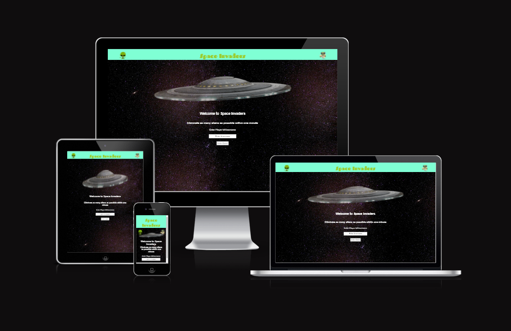

# Space Invaders

## Intended Purpose of This Website:

This website is a simple fun game that uses JavaScript to allow users to interact with it. The user can navigate the ship left and right with the left and right arrow keys on desktop and has some left and right buttons to press while on mobile or touch screen devices. They can also shoot with the spacebar being pressed down or by using the circular icon on mobile devices. The user is given one minute to shoot as many enemies as possible before the time runs out and the game re-loads. Their current score is tracked throughout the game and their name is added to the game after they enter it on the welcome screen. A live link to the deployed game is given here: [My git hub pages link of live website](https://gfpkelly1986.github.io/space-invaders/) 

